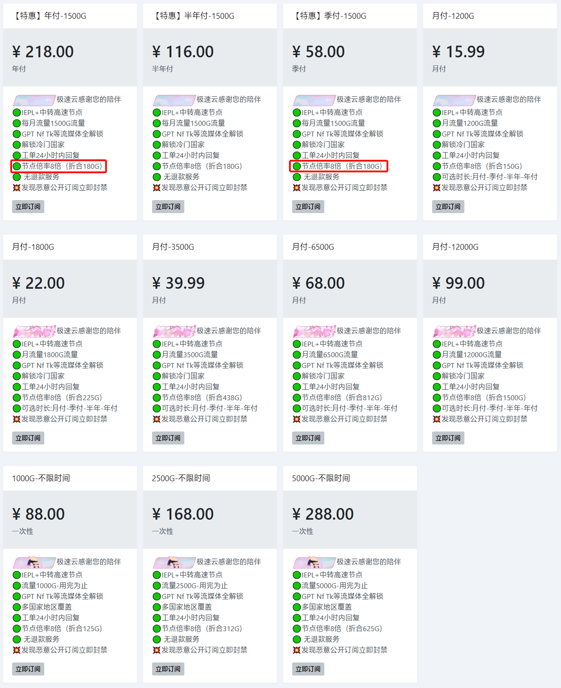

# 极速云官网最新地址

下面是极速云jisuyun最新地址：

永久官网：[极速网.com](https://w4.rouhe88.com/#/register?code=GWVUVWMC) 

直连地址1：[极速666.com](https://w4.rouhe88.com/#/register?code=GWVUVWMC) 

---

**温馨提示：任何服务均有跑路风险，请自行注意防范！**

**本页面仅分享网络信息，不做推荐，有问题请自行联系服务商处理！**

---

## 简介

极速云jisuyun成立于2023年，套餐价格便宜，线路带宽充裕不拥挤。最高每月400GB+使用流量，不限制速率。

IEPL+中转高速节点、GPT、奈飞、Tk等流媒体全解锁、解锁冷门国家……

## 极速云特色

<ul>
	<li>流量充足，价格便宜，线路节点档次分明，覆盖绝大多数人群的使用需求；</li>
	<li>拥有遍布全球的CN2 GIA/BGP/IPLC内网专线等优质线路节点；</li>
	<li>国内采用CN2/BGP入口，隧道中转，极速稳定；</li>
	<li>付费节点全部解锁Nitflix/HULU/HBO等国外流媒体；</li>
</ul>

## 极速云jisuyun套餐价格

月付低至￥15+/月，也有按量计费不限时套餐。

注意：套餐倍率较高，以折合流量为准！

---

**温馨提示：任何服务均有跑路风险，请自行注意防范！**

**本页面仅分享网络信息，不做推荐，有问题请自行联系服务商处理！**

---
