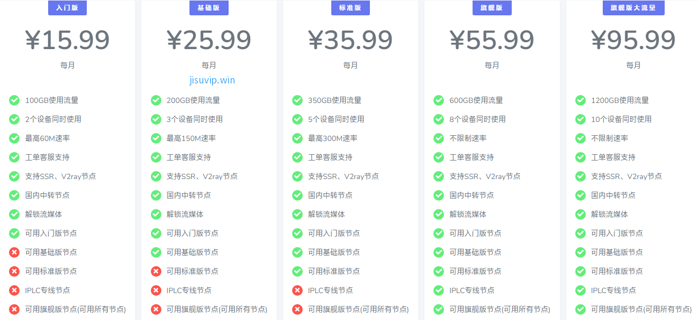

# 极速VIP官网地址2025最新入口 + 优惠码

极速VIP跑路了吗？暂时没有。不过机场总会有跑路风险，为尽可能减少损失，选购套餐可按月支付。下面是最新地址：

永久官网：[feisucloud.com](https://jisuvip.win/out/jisu) （原[jisuvip.com](https://jisuvip.win/out/jisu)貌似已经废弃）

地址1：[https://Vip.xixi6.net](https://Vip.xixi6.net/auth/register?code=SmHn)

## 简介

极速VIP机场怎么样？，jisuvip是某大机场分站。新站价格便宜，线路带宽充裕不拥挤。最高每月500GB使用流量，8个设备同时使用，不限制速率。

支持SSR、V2ray节点，国内中转节点，解锁流媒体，CN2/BGP隧道中转和IPLC国际专线节点。

支持支付宝、微信支付。限时优惠v4套餐15.99元，V3套餐25.99元，V2套餐35.99元，V1套餐55.99元，品质有保证

节点包括台湾, 新加坡, 日本, 法国, 美国, 韩国, 香港, 马来西亚等国家和地区。

## 极速VIP特色

<ul>
	<li>流量充足，价格便宜，线路节点档次分明，覆盖绝大多数人群的使用需求；</li>
	<li>支持主流客户端 SSR/V2Ray 订阅链接；</li>
	<li>拥有遍布全球的CN2 GIA/BGP/IPLC内网专线等优质线路节点；</li>
	<li>国内采用CN2/BGP入口，隧道中转，极速稳定；</li>
	<li>付费节点全部解锁Nitflix/HULU/HBO等国外流媒体；</li>
</ul>

## 极速VIP套餐价格

|套餐|入门版|基础版|标准版|旗舰版|旗舰版大流量|
|----|----|----|----|----|----|
|月付|￥15.99|￥25.99|￥35.99|￥55.99|￥95.99|
|季付|￥47.97|￥77.97|￥107.97|￥167.97|￥287.97|
|半年付|￥95.94|￥155.94|￥215.94|￥335.94|￥575.94|
|年付|￥191.88|￥311.88|￥431.88|￥671.88|￥1151.88|
|两年付|￥383.76|￥623.76|￥863.76|￥1343.76|￥2303.76|

## 极速VIP优惠码

包年82折优惠代码：[T82](https://jisuvip.win/out/jisu)

## 极速VIP官网常见问题

问：按照教程配置完毕后但是还是无法访问外网。

1. 请先同步系统时间。
2. 检查浏览器是否有代理插件，如果有的话请卸载。
3. 然后将软件调成直连模式。
4. 重启设备，再进行尝试。

问：无法更新订阅，请问应该怎么办？

1. 尝试把订阅地址复制到浏览器看能否打开或下载到TXT文件。
2. 如果能打开或下载到TXT文件，那就是系统的问题，请先同步系统时间然后将软件调整到直连模式并重启设备。
3. 如果不能打开或下载到TXT文件，那就是网络的问题，先去网站节点列表手动添加一个节点，确定这个节点能用并且连接这个节点开启全局代理模式再进行更新订阅。

问：节点名称开头的V1、V2、V3、V4分别代表什么？

答：V1代表旗舰版节点，V2代表标准版节点，V3代表基础版节点，V4代表入门版节点。

问：购买VIP后是否有限速？

答：V1不限制速率，V2最高速率300M，V3最高速率150M，V4最高速率60M。

问：购买、升级、续费套餐需要注意些什么？

1. 购买相同等级套餐：流量不会叠加，时间会叠加。
2. 购买不同等级套餐，流量和时间都不会叠加。
3. 如需更换套餐，请至首页点击【升级套餐】按钮。
4. VIP会员到期流量是会清零的，年费、半年、季费会员流量为一次性到账，相对来说年费划算些，流量有一年有效期。
